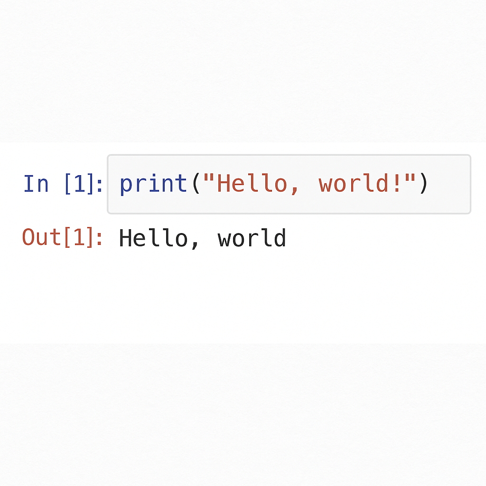

```{r, setup, include = F}
# devtools::install_github("dill/emoGG")
library(pacman)
p_load(reticulate, xaringanBuilder)
```

# Escribiendo Código en Python

Python es un lenguaje de programación versátil que se puede escribir y ejecutar de múltiples formas, dependiendo de tus necesidades y del entorno en el que trabajes.

<b style="color:green">1.- Editores de texto enriquecidos (IDE o editores de código)</b>

Son programas que permiten escribir código, explorarlo, depurarlo y ejecutarlo fácilmente.

  -**Visual Studio Code (VS Code)**: uno de los más populares. Soporta extensiones, resaltado de sintaxis, autocompletado, ejecución integrada y más.

  -**PyCharm**: IDE especializado en Python, con herramientas avanzadas para proyectos grandes.

  -**Sublime Text**, **Atom**, entre otros.
--
<br>

En estos entornos, puedes:

* Escribir tu código en archivos `.py`, como `hello.py`.

* Ejecutarlos desde la terminal integrada:

  ```bash
  python hello.py
  ```
---
# Escribiendo Código en Python

<b style="color:green">2.- Entornos interactivos como Jupyter Notebook</b>

Jupyter permite escribir código en bloques o celdas, mezclarlo con texto en Markdown, y ejecutar el código de forma incremental.

* Ideal para análisis de datos, visualizaciones, docencia e investigación.
* Permite ver resultados inmediatamente debajo del código.
* Replicabilidad
* Usa extensiones como `.ipynb` en lugar de `.py`.



---
# Escribiendo Código en Python

<b style="color:green">3.- Terminal interactiva (IPython o Python REPL)</b>

Puedes abrir una terminal y ejecutar:

```bash
python
```

o bien:

```bash
ipython
```

Esto abrirá un entorno donde se puede escribir código línea por línea. Por ejemplo:

```python
>>> print("Hola")
Hola
```

Es ideal para probar fragmentos pequeños de código rápidamente.

---
# Escribiendo Código en Python

En la celda de JN vamos a escribir un _código_ y vamos a guardarlo en un fichero _.py_

.pull-left[
<b style="color:#6082B6">Vamos a escribir</b>
```python
%%writefile hello_JN.py
print("Hola Daniel")
```
]

--

.pull-right[

<b style="color:#6082B6">Vamos a ver si lo creó</b>
```python
!ls hello_JN.py
```
]

--

.pull-left[
<b style="color:#6082B6">Vamos a ejecutarlo</b>
```python
%run hello_JN.py
```
]

.pull-right[
<b style="color:#6082B6">Resultado</b>
```python
Hola Daniel
```
]


---
# Escribiendo Código en Python

Cuando escribimos `print("Hola Daniel")` hemos usado una <b style="color:brown">función</b> en Python: una regla o conjunto de instrucciones que, dadas ciertas entradas (o incluso ninguna), realiza una acción y puede producir un resultado.

--

> En este caso, `print` es una función predefinida que toma un argumento (el texto `"Hola Daniel"`) y produce un efecto: mostrar ese texto en pantalla.

--

> Veremos que las <b style="color:brown">funciones</b> son una parte fundamental en la escritura de un script en Python.


---

# Variables

Podemos **personalizar** el programa: saludar a quien conteste desde el teclado

--

.pull-left[
<b style="color:#6082B6">Escribamos</b>
```python
%%writefile hello_JN.py
input("¿Cómo te llamas?")
print("Hola Mundo")
```
]

--

.pull-right[
<b style="color:#6082B6">Ejecutemos</b>
```python
%run hello_JN.py
```
<span style="color:green">¿Produjo el resultado deseado?</span>
]

--

> **No**, debido a que no imprimió en pantalla el nombre del usuario.

--

> <span style="color:green">¿Será que nos hemos olvidado de asignar el nombre a una **variable**?</span>

--

<br>
<br>
En principio, pensemos en una **variable** como un  `contenedor`(container) de valores. 


---
# Variables


Podemos guardar el resultado de la función `input` así:


```python
nombre = input("¿Cómo te llamas? ")
print("Hola Mundo")
```

--
.pull-left[
Pero no funcionó: no imprimió el `nombre`
]

--

.pull-right[
Podríamos escibir `print("Hola nombre")`
]

--

.pull-left[
Pero tampoco funciona!!!!!
]

--

.pull-right[
Claro...podríamos directamente poner otro print

<b style="color:#6082B6">
Introducimos otro `print`</b>

```python
nombre = input("¿Cómo te llamas? ")
print("Hola")
print(nombre)
```
]

---
# Variables

.pull-left[

<b style="color:#6082B6">O más compacto</b>
```python

nombre = input("¿Cómo te llamas? ")
print("Hola" + nombre)
```
]

--

.pull-right[

<b style="color:#6082B6">O incluso</b>

```python
print("Hola,", nombre)
```
]

--

.pull-left[
<b style="color:#6082B6">Agregamos comentarios `#`:</b>

```python
# Pedir el nombre al usuario
nombre = input("¿Cómo te llamas? ")
print("Hola,", nombre)
```
]

--

.pull-right[
<b style="color:#6082B6">Formato con f-strings</b>
```python
# Pedir el nombre al usuario
nombre = input("¿Cómo te llamas? ")
print(f"Hola, {nombre}")
```
]

>El prefijo `f` indica que Python debe insertar el <span style = "color:#6082B6 ">valor de la variable</span> dentro de las llaves `{...}`


---
# Variables

Una <b style="color:brown">variable</b> es una referencia (nombre simbólico) a un objeto que reside en memoria. 

--

>Al asignar un valor con el operador `=`, el nombre de la variable se enlaza a una ubicación de memoria que contiene un objeto Python.

>>En `nombre = input("¿Cómo te llamas? ")`, la variable `nombre` no contiene directamente el valor del nombre, sino que apunta a un objeto  almacenado en el `heap` de Python. 

>>Python gestiona este enlace mediante un sistema de referencias (punteros internos) y un recolector de basura.

--

.pull-left[
<b style="color:#6082B6">Cada variable tiene un `type`</b>
````python
x = 5              
precio = 12.99     
nombre = "Ana"     
activo = True      
````
]

--

.pull-right[
<b style="color:#6082B6">Escribir</b>
````python
type(x)      -> int
type(precio) -> float
type(nombre) -> str
type(activo) -> bool
````
]

---
# Variables

Cada <b style="color:brown">variable</b> es una referencia a un objeto único en memoria. 

>Incluso si dos variables contienen valores iguales, los objetos a los que apuntan pueden (o no) ser los mismos, dependiendo del tipo y del contexto de creación.

--

.pull-left[
<b style="color:#6082B6">Tipear</b>
````python
x = 10.0
y = 10.0
print(id(x))      
print(hex(id(x)))
print(id(y))
print(hex(id(y)))
````
]

--

.pull-right[
<b style="color:#6082B6">Tipear</b>

````python
x = 10
y = 10
print(id(x))      
print(hex(id(x)))
print(id(y))
print(hex(id(y)))
````
]

>Python pre-asigna (internamente) los objetos enteros pequeños —por defecto, los valores enteros entre -5 y 256— y los reutiliza para optimizar el rendimiento y el uso de memoria.

---

# Variables

Vamos este ejemplo: observar `x is y`

.pull-left[

````python
x = 10
y = x
print(id(x))      
print(hex(id(x)))
print(id(y)      )
print(hex(id(y)))
print(x is y) 
x = 3
print("\n")
print(id(x))      
print(hex(id(x)))
print(id(y)      )
print(hex(id(y)))
print(x is y)
print(x)
print(y)
````
]

--

.pull-right[
<b style="color:#6082B6">Typer</b>

````python
type(x is y)
````
]


---
# Variable type `str`

¿Qué puedes hacer con una variable tipo `str`?

.pull-left[
Puedes limpiar espacios en blanco al principio y al final de la cadena.

```python
nombre = input("¿Cómo te llamas? ")
nombre = nombre.strip().title()
print(f"Hola, {nombre}   ")
```
]

--

.pull-right[

También puedes encadenar todo en una línea:

```python
nombre = input("¿Cómo te llamas? ").strip().title()
print(f"Hola, {nombre}   ")
```
]

--

.pull-left[

<span style="color:brown">¿Qué cosas puede _hacer_ un objeto `str`?
```python
dir(nombre)
```
]

---

# Variable type `int`

.pull-left[
<b style="color:#6082B6">Pidamos al usuario dos enteros</b>
```python
x = input("¿Cuál es x? ")
y = input("¿Cuál es y? ")
print(x + y)
```
]

--

.pull-right[
<b style="color:#6082B6">¿Que `type` es `x` o `y`?</b>
```python
x = input("¿Cuál es x? ")
print(type(x))
y = input("¿Cuál es y? ")
print(type(y))
```
]

--

.pull-left[
<b style="color:#6082B6">Convertir el `type` a `int`</b>
```python
x = int(input("¿Cuál es x? "))
print(type(x))
y = int(input("¿Cuál es y? "))
print(type(y))
print(x+y)
```
]

.pull-right[
Objetos: segun su `type`tienen asociado

**Atributos** → Son variables internas del objeto que describen su estado o propiedades.

**Métodos** → Son funciones asociadas al objeto que permiten modificarlo o interactuar con él.
]

---
# Variables type `float`

.pull-left[
<b style="color:#6082B6">Convertir el `type` a `float`</b>
```python
x = float(input("¿Cuál es x? "))
y = float(input("¿Cuál es y? "))
print(round(x / y, 2))  
print(f"{x / y:.2f}") 
```
]

--

.pull-right[
<b style="color:#6082B6">Veamos: que es `round` o `.2f`</b>

Cuando no sabemos algo: <b style="color:tomato">preguntamos</b>

> <a href= "https://docs.python.org/3/library/functions.html" style="color:brown">Built in Functions: Documentation</a>


]

.pull-right[
<b style="color:#6082B6">Veamos: que es `round` o `.2f`</b>

Cuando no sabemos algo: <b style="color:tomato">preguntamos</b>

> <a href= "https://docs.python.org/3/library/functions.html" style="color:brown">Built in Functions: Documentation</a>


]
